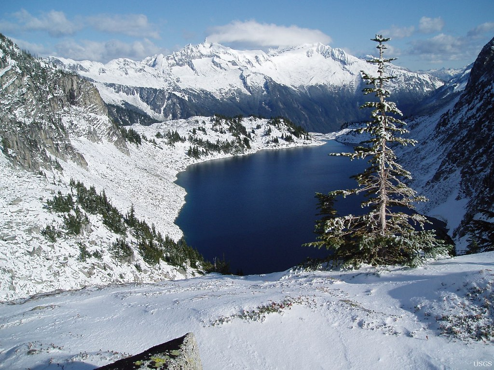

Listen to `alyzea - logged in for hours` while reading!

<iframe style="border-radius:12px" src="https://open.spotify.com/embed/track/7ClvPk3XRxD6WNKciMvguB?utm_source=generator" width="100%" height="152" frameBorder="0" allowfullscreen="" allow="autoplay; clipboard-write; encrypted-media; fullscreen; picture-in-picture" loading="lazy"></iframe>

There's a special kind of fun in taking a machine that the e-waste gods already claimed and turning it into something useful. This is the story of how a **2007 Acer Aspire 5315**, with its dead CMOS battery, dying speaker, and single-core Celeron 560, became a Docker server running in my living room in 2026.



## the corpse


The specs would make a Raspberry Pi laugh:

- Intel Celeron 560 @ 2.13 GHz (single core, no hyperthreading, no feelings)
- ~1 GB of RAM
- 320 GB spinning HDD (Samsung HM320JI)
- BIOS only, of course. UEFI was two years in the future
- A CMOS battery so dead that the hardware clock boots into **January 1st, 2001**

The plan: Alpine Linux edge, Docker, SSH, Tailscale. A headless box that costs zero dollars and uses about 35 watts.

## installing linux without an installer


Here's the part I'm proudest of. Instead of burning an ISO, I plugged the laptop's HDD into a **USB adapter on my desktop**, partitioned it there, and hand-built the system:

```sh
# MBR layout: 512M /boot + everything else /
sfdisk /dev/sdb <<EOF
label: dos
start=2048, size=1M, type=83
start=3072, type=83
EOF

# Alpine minirootfs: a ~30MB tarball that IS the distro
wget https://dl-cdn.alpinelinux.org/alpine/edge/releases/x86_64/alpine-minirootfs-3.25.0_alpha20260805-x86_64.tar.gz
tar -xzf alpine-minirootfs-*.tar.gz -C /mnt/alpine

# chroot in and build the world
mount --bind /dev /mnt/alpine/dev && chroot /mnt/alpine
apk add linux-lts linux-firmware grub-bios docker openssh ...
```

A minirootfs install is a bit like assembling furniture from the parts list instead of the instructions, you get to see every screw. It also means you're responsible for things an installer usually hides.

### The bugs an installer would have hidden

And hide them it does. Three gems from this install:

**1. The empty runlevels.** A minirootfs ships with *nothing* in `/etc/runlevels/*`. After my first boot the network card driver never loaded, no `eth0` at all. The culprit: the `hwdrivers` service was missing from `sysinit`. OpenRC doesn't just "start services"; someone has to put them in the right runlevel, and that someone is you.

**2. The user with a shell that didn't exist.** I set my user's shell to `/bin/bash`, but the path was written as `/usr/bin/bash` somewhere in my notes. sshd refused every login with the wonderfully opaque `User luis not allowed because shell /usr/bin/bash does not exist`. A one-character path bug on a machine 5,000 km away from the user.

**3. The initramfs that couldn't mount root.** Boot hung with `mount: mounting /dev/sda2 on /sysroot failed: No such file or directory`. The fix was adding `rootfstype=ext4` to the kernel command line, without it, mkinitfs tries every filesystem and gives up.

## test the whole boot *before* touching the laptop


The HDD was still in a USB adapter on my desk, so I did something absurd and wonderful: **booted the laptop's future disk in QEMU** on the desktop, with port-forwarded SSH:

```sh
qemu-system-x86_64 -enable-kvm -cpu host -m 1024 \
  -drive file=/dev/sdb,format=raw,if=ide \
  -nic user,model=e1000,hostfwd=tcp:127.0.0.1:2222-:22
```

Before the laptop even knew anything was happening, I had confirmed: GRUB boots, kernel boots, network comes up, sshd accepts logins, Docker runs `hello-world`, both swaps are active. Finding a boot bug in QEMU takes 30 seconds; finding it on a 2007 laptop whose only output is beep codes takes a lot longer.

## when your filesystem can't trust time itself


The laptop finally booted from its own hardware. Then I ran `apk add micro`:

```
ERROR: micro-2.0.15-r6: TLS: server certificate not trusted
```

Every HTTPS fetch failed. Why? I ran `date`:

```
Mon Jan  1 17:52:41 -02 2001
```

The dead CMOS battery meant every boot starts in 2001, and no TLS library on earth will accept a certificate "not yet valid" for another decade. Worse: chronyd refuses to make a 25-year jump automatically, because a correction that big looks like a broken clock, not a broken timezone.

The fix that made me feel smart:

```
# /etc/chrony/chrony.conf
makestep 1.0 3
```

`makestep` says "in the first 3 clock updates, if the offset is huge, just *step* the clock instead of gently slewing it." Now every boot self-heals: kernel comes up in 2001, chronyd politely time-travels to the present, and TLS works. The clock is wrong for about four seconds per boot, which is the most acceptable way to be wrong.

## 1 gb of ram: swap architecture


With this little memory, swap isn't an afterthought, it's architecture. The setup:

- **4 GB of zram** (compressed RAM swap, lz4, priority 100), this is what gets touched first
- **4 GB swapfile on disk** (priority -2), the overflow valve
- sysctl tuned for the compressed-swap life:

```
vm.swappiness = 150          # yes, over 100, zram is faster than disk
vm.page-cluster = 0          # 4KB swap pages, zram doesn't want clustered reads
kernel.sched_autogroup_enabled = 1
vm.watermark_scale_factor = 125
```

Result: about **190 MB of RAM in use** with Docker, sshd, chrony and tailscaled all running. Idle load 0.00.

## the hdd deserves better deadlines


A spinning disk with a single-core CPU means the I/O scheduler matters. The default `mq-deadline` optimizes latency at the storage layer; **BFQ** optimizes fairness between processes, when a build is hammering the disk, my SSH session still feels snappy:

```
ACTION=="add|change", KERNEL=="sd[a-z]", ATTR{queue/rotational}=="1", ATTR{queue/scheduler}="bfq"
```

Plus `read_ahead_kb=1024` (spinning disks love reading ahead) and `commit=60` on ext4 so the journal doesn't flush every 5 seconds.

## silencing the machine


This part got weird. The laptop **beeped. A lot.** Every boot, a chorus of PC-speaker shrieks. I spent a while blaming GRUB, then the kernel, then myself:

- Blacklisted `pcspkr` (module never loads now)
- Emptied `GRUB_INIT_TUNE` (no boot melody)
- Set `GRUB_TIMEOUT=0` (it kept stopping at the menu and, with a flaky keyboard, beeping at me)

…only to realize the beeps happen **before the bootloader loads**. It's the BIOS POST, screaming "YOUR CMOS BATTERY IS DEAD" in the only language it speaks. You cannot silence a BIOS POST beep with software. That one costs exactly one CR2032 and five minutes with a screwdriver. Fair trade.

While I was in there, I made the machine *fully* silent in spirit:

- **Auto-login on tty1**: `getty -n -l` pointing at a tiny script that runs `login -f luis`. It's a headless server; the console shouldn't demand a password
- **Killed the LCD**: a `local.d` script that writes `4` (power off) to `bl_power` and the framebuffer blank at every boot. The screen doesn't "show a console", it just doesn't exist anymore. Recovery is one SSH command away, which is exactly how a server should work

## the tailscale death spiral (and how to avoid it)


Tailscale on a home server is a superpower: the box gets a stable 100.x address reachable from anywhere, no port forwarding, no router configs. Mine connects *directly* to my desktop, no relay in between.

But I learned about a failure mode the hard way. Tailscale, by default, **takes over `/etc/resolv.conf`** and points it at its own MagicDNS resolver (100.100.100.100). If tailscaled ever goes down while it owns your DNS… your machine can't resolve names, which means it can't fetch `controlplane.tailscale.com`, which means tailscaled can't come back up. A service outage that *prevents its own recovery*, an ouroboros of DNS.

The server-side fix is one flag:

```sh
tailscale up --accept-dns=false
```

The server uses ordinary DNS (1.1.1.1), and MagicDNS still works on every other device in the tailnet. The loop can't happen again.

## living with it


The daily-driver experience is nicer than "2007 laptop" suggests:

```sh
ssh server-acer -tt btop        # full TUI, UTF-8, via LAN
ssh server-acer-ts              # same box from anywhere on earth
docker run -d something         # 190MB of RAM says yes
cargo install anything          # musl-linked, static, fast
```

Btop on this machine taught me a lesson about Alpine: it has no locales at all out of the box (musl philosophy), so you install `musl-locales`, add `LANG=C.UTF-8` to `/etc/environment`, and flip `PermitUserEnvironment yes` in sshd so that *non-interactive* `ssh host 'btop'` commands get the locale too. Every layer of a system has opinions about your terminal, apparently.

Oh, and compiling a Rust utility (swaptop) on a single-core 2.13 GHz Celeron takes about 20 minutes. It compiles. That's the point. It compiles.

## the scoreboard


| Metric | Value |
|---|---|
| Cost of hardware | $0 (was headed to the trash) |
| RAM at idle, full stack | ~190 MB / 956 MB |
| Boot to SSH | ~40 s (HDD spinning rust included) |
| Packages installed | ~320 |
| BIOS beeps remaining | All of them (hardware's fault) |
| Time traveled per boot | 25 years, ~4 seconds |

## what i'd tell someone doing this


1. **QEMU-test a bare-metal disk before bare metal.** A spare disk in a USB adapter is a dress rehearsal.
2. **Minirootfs teaches you where the installer hides.** Runlevels, initramfs features, users' shells, all yours.
3. **A wrong system clock breaks everything silently**, then noisily. `makestep` is your friend on dead-battery hardware.
4. **On tiny-RAM boxes, design swap on purpose**: zram first, disk second, sysctl to match.
5. **Headless means headless**: auto-login console, powered-off screen, one flag so Tailscale can't take DNS hostage.
6. Keep a **CR2032 in the drawer**. It's the cheapest uptime you'll ever buy.

The machine that couldn't boot a modern web page reliably in 2007 now runs containers around the clock, wakes up with the correct year, and answers SSH from two continents. Long live the dead.

## image credits

- cover: [all setup for daily use - the 23 year old Apple //c](https://www.flickr.com/photos/35448539@N00/2376243912) by blakespot (by 2.0)
- image: [Hidden Lake](https://www.flickr.com/photos/27784370@N05/8547777933) by U.S. Geological Survey (cc0 1.0)
