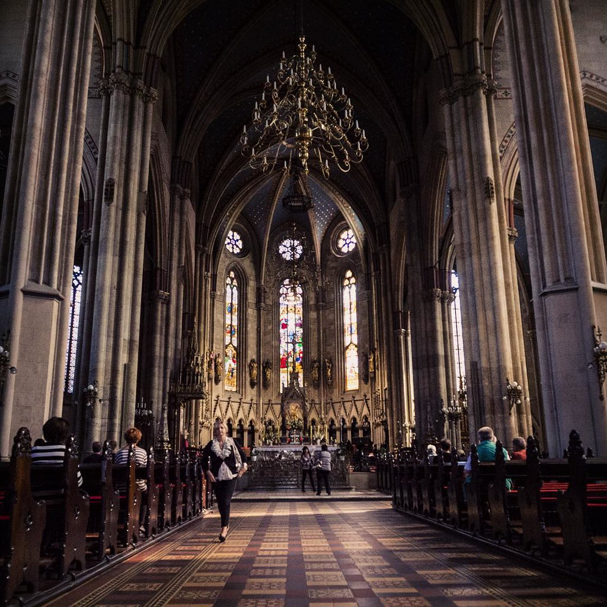

Construction on Cologne Cathedral began in 1248 and stopped in 1473. The crane they left on the tower stayed there for **400 years**. Work resumed in 1842 and finished in 1880. Six hundred and thirty-two years, and the people who laid the foundation never met the people who raised the spires.

I work on infrastructure that will ideally outlive my involvement. Cathedrals are the most honest case study of that situation, because they couldn't hide behind "the team will remember".

## plans travel; memory doesn't

Medieval builders worked from plans, templates and *tracery*: geometric drawings that encoded the design so it could be executed by masons who never met the architect. They also left **mason marks** on stones, small signatures that let a master know who cut what, and today let historians reconstruct who worked where.

In software, plans are schemas, ADRs, and tests. Mason marks are commit history and code ownership. When those are missing, the next team re-derives the design from the ruin, often wrongly. Documentation is not bureaucracy; it is how design crosses generations.

## scaffolding is allowed to be ugly

Cathedrals were built with temporary scaffolds that held everything while the real structure grew. Nobody preserved the scaffolds, but they were engineered just as seriously.

Our scaffolds are build servers, migration scripts, feature flags, one-off admin panels. They don't need beauty. They need to hold weight and come down safely. Confusing a scaffold for architecture is how you end up maintaining a crane for 400 years.

## maintenance is the actual product

What keeps a cathedral standing is not the first construction. It's the ongoing work: replacing weathered stone, repairing lead roofs, re-pointing mortar. Notre-Dame burned in 2019 and the question was never "can we build a cathedral", it was "can we restore *this* one, and do we still know how".

Legacy systems are the same. The interesting engineering question about a ten-year-old service is not "how do we rewrite it", it's "do we understand it well enough to change it safely". The answer is always cheaper to produce *before* you need it.

## what I took from this

- Design for the person who inherits the work, not for the demo.
- Record decisions where the future can find them, near the code.
- Treat temporary scaffolding as temporary, and remove it on purpose.
- The monument is the maintenance schedule. Everything else is the opening ceremony.

I write commit messages and docs for a colleague I will never meet. That colleague is me, in five years, with no memory of why anything is the way it is.

## image credits

- cover: [St. Vitus Cathedral at Christmas](https://www.flickr.com/photos/99424477@N04/11371047023) by prague.czech.photo (by 2.0)
- image: [8월에 휴가를 떠나는 친구때문에 다시 들춰본 2013년 가을의 크로아티아 #Travel #Memories #Throwback #2013 #Autumn #Zagre](https://www.flickr.com/photos/66172503@N00/18866402363) by IchStyle (by 2.0)
