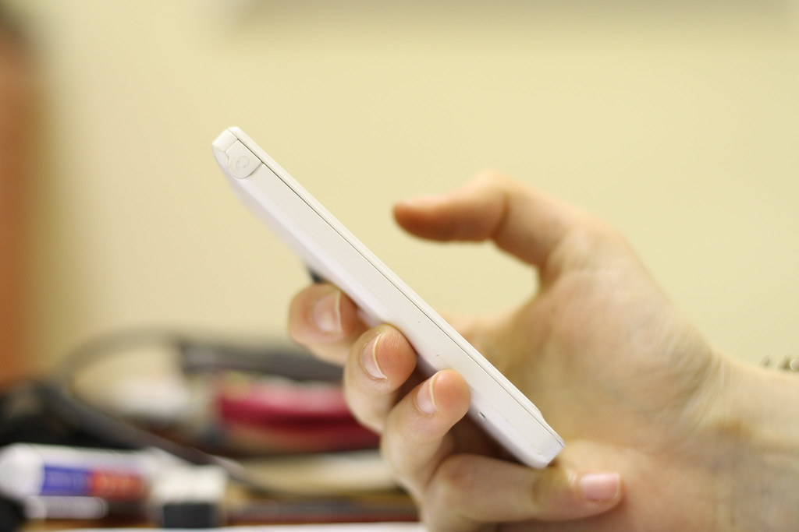

clipsync protocol notes: teaching two clipboards to stop agreeing



an internal design doc, cleaned up.

---

## problem statement

device A and device B share a clipboard. when the user copies on A, B must receive it. when they copy on B, A must receive it. when the system applies a remote value, it must not mistake that for a user copy and send it back.

the naive implementation works perfectly for exactly one copy, then enters an infinite loop of two polite machines agreeing with each other.

---

## message flow

```
user copies "hello" on A
    A: local watcher fires, value != last_applied
    A -> B: SYNC { value, origin: A, rev: 41 }
    B: applies value, records last_applied = fingerprint("hello", 41)
    B: local watcher fires for the applied change
    B: fingerprint matches last_applied -> dropped
    (silence)
```

without the `last_applied` record, step 5 never happens and the loop begins. the whole protocol exists to make step 5 possible.

---

## invariants

1. **every sync message carries an origin and a revision.** the clipboard has no provenance field, so the protocol supplies one.
2. **applying a remote value is not a local edit.** it is recorded, then ignored by the watcher.
3. **a value is broadcast at most once per revision.** retransmission is for reliability, not for change detection.
4. **pairing is out-of-band.** devices show a fingerprint; the user confirms it once. after that, the channel is authenticated and encrypted.
5. **the relay is blind.** it forwards ciphertext between paired devices and cannot read the payload.

---

## content types

clipboards carry text, HTML, images, file lists. one copy can publish several representations. the receiver picks the richest type both sides declare. if only one representation is supported, it is used, and that is still correct.

the subtle rule: never silently downgrade to something lossy. if the receiver cannot handle the type, it declines the sync instead of pasting broken content.

---

## failure modes designed for

- **relay down:** devices on the same LAN discover each other directly; the relay is only needed off-LAN.
- **duplicate delivery:** handled by revisions; applying the same revision twice is a no-op.
- **clock skew:** revisions are per-device counters, not timestamps. no clock trust required.
- **partial writes:** a sync that fails mid-transfer is retried; the previous clipboard value remains untouched until a complete payload arrives.

---

## implementation note

the core is a Rust crate (`clipsync-core`, published to crates.io) with the platform watchers as thin adapters. that is what made the loop logic testable without two real devices: the protocol tests simulate both sides and assert silence after the echo.

the hardest part of the project was teaching two programs to *not* react. everything else was plumbing.

## image credits

- cover: [Clipboard Desk](https://stocksnap.io/photo/clipboard-desk-VXAISJRBH9) by Design by Matt (cc0 1.0)
- image: [Phone](https://www.flickr.com/photos/69670601@N05/15518829557) by Alexandra E Rust (by 2.0)
