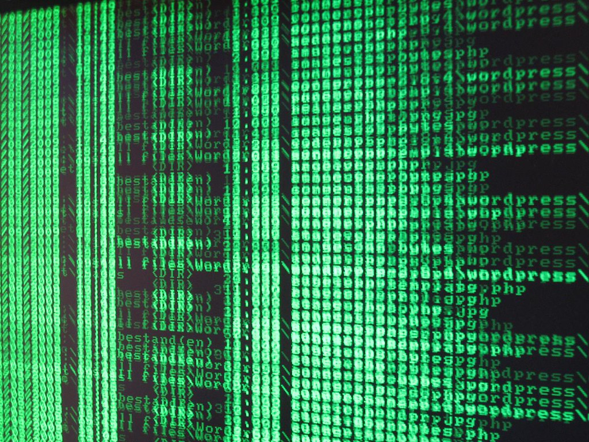

You can find the code at: [github.com/luis-ota/luis-ota-portfolio](https://github.com/luis-ota/luis-ota-portfolio).

Listen to `FrankJavCee - SimpsonWave1995` while reading!

<iframe style="border-radius:12px" src="https://open.spotify.com/embed/track/0qqRNnwh86N1XBV94GVgQN?utm_source=generator" width="100%" height="152" frameBorder="0" allowfullscreen="" allow="autoplay; clipboard-write; encrypted-media; fullscreen; picture-in-picture" loading="lazy"></iframe>

a debugging session: why is my own site serving 2024 to me?



a transcript, lightly edited, from a tuesday.

---

**me:** the deploy is green. the HTML is new. the toggle I added does not exist.

**browser:** refresh. still no toggle.

**me:** hard refresh. toggle appears. close tab. reopen. toggle gone again.

**browser:** `cache-control: public, max-age=14400`, `cf-cache-status: HIT`, `age: 1656`.

**me:** age 1656. twenty-eight minutes old. the deploy was six minutes ago. so this is not the *old* deploy, it is a cached copy of *some* earlier response, served under the same URL.

**cdn:** `script.js`. same path as before. you changed the contents, not the address. why would I fetch again?

**me:** because I sent `no-cache` from origin for HTML.

**cdn:** for HTML, sure. `script.js` had a `max-age`, and I keep my own TTL for static assets. also, every visitor who came before this deploy has the old file cached with `immutable, max-age=2592000` from your previous server config. thirty days. you cannot take that promise back.

**me:** so the fix is not a header.

**cdn:** the fix is a different URL.

**me:** ...

---

so that is what I did. the repo references assets with a placeholder, and CI stamps the commit into it:

```bash
V="${GITHUB_SHA::7}"
sed -i "s/?v=dev/?v=$V/g" public/index.html
```

each deploy changes every asset URL. old cached copies become irrelevant because nobody asks for those addresses anymore. no purging, no negotiation with the CDN, no "please revalidate" that can be ignored.

for the other site I went further: nginx sends `no-cache` for the whole static tree, and the assets are versioned anyway. belt and suspenders, because the failure mode of a stale asset is subtle: the page *works*, just wrong.

---

**me:** and the lesson?

**cdn:** "deployed" is a word about your server. "served" is a word about the world. verify with `curl` from outside, check a version marker, every time.

**me:** also: if a user's browser has an `immutable` copy, you can only escape by moving.

**cdn:** now you get it.

---

*the stamped version is visible: every asset in my HTML carries `?v=<commit>`. when I need to know what is live, I read my own HTML like a stranger would.*

## image credits

- cover: [Clouded sky](https://www.flickr.com/photos/55856449@N04/10190046744) by Infomastern (by-sa 2.0)
- image: [My Desire screenshot from '99](https://www.flickr.com/photos/35468151816@N01/181564444) by danbri (by 2.0)
