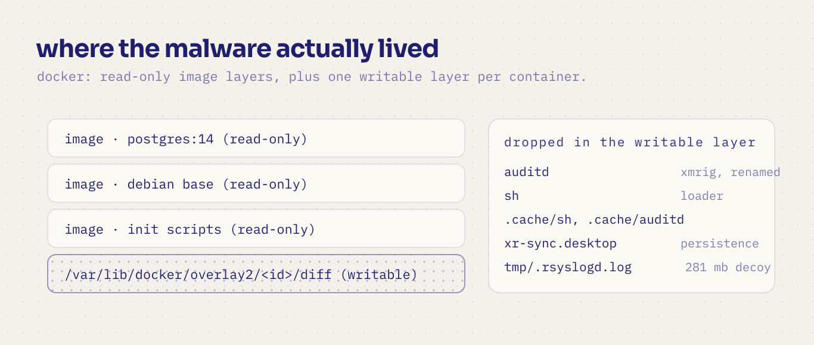
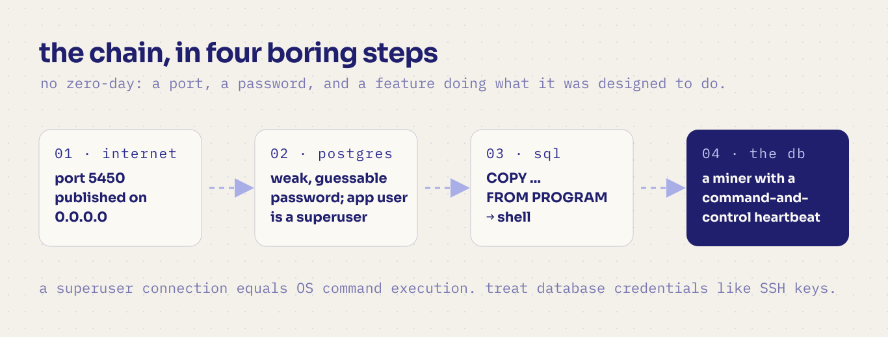
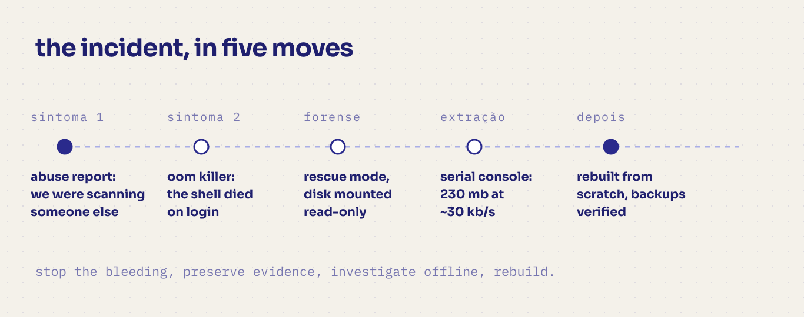

Listen to `bôa - Duvet` while reading!

<iframe style="border-radius:12px" src="https://open.spotify.com/embed/track/42qNWdLKCI41S4uzfamhFM?utm_source=generator" width="100%" height="152" frameBorder="0" allowfullscreen="" allow="autoplay; clipboard-write; encrypted-media; fullscreen; picture-in-picture" loading="lazy"></iframe>

> **Disclaimer:** this is an anonymized post-mortem. All IP addresses, hostnames,
> company names, customer details and exact dates have been removed or generalized.
> No customer data was harmed in the making of this blog post. Published for educational
> purposes only.

## TL;DR

- A small production server (an ERP SaaS running in Docker: app + PostgreSQL) was compromised.
- The root cause was not a fancy exploit: **a database port published to the internet with a weak, guessable password**, on a user that is a *superuser by default*.
- The attacker used PostgreSQL's own `COPY ... FROM PROGRAM` feature to run shell commands, dropped a **Monero miner (XMRig)** with disguised names, and used the box to scan the internet until our hosting provider's abuse desk came knocking.
- The server ran out of memory, the kernel started killing processes, and eventually **you couldn't even keep an SSH shell alive**.
- We did **offline forensics** (booted a rescue image, mounted the disk read-only, inspected Docker's writable layers), extracted every byte of customer data **through the serial console** (yes, base64 at ~30 KB/s, chunked and hash-verified), audited the data for tampering, and rebuilt everything from scratch.
- Lessons at the bottom. If you only read one: **never publish your database port to the internet. Ever.**

---

## The setup

Like a lot of small teams, we ran lean: one cloud VM, a Docker Compose stack with an
ERP application and a PostgreSQL container, a reverse proxy in front, automated uploads
to object storage, and a dream. It had served us well for months.

The Compose file had the kind of line that looks harmless and isn't:

```yaml
services:
  db:
    image: postgres:14
    ports:
      - "5450:5432"              # published on 0.0.0.0
    environment:
      - POSTGRES_USER=app
      - POSTGRES_PASSWORD=<a weak, guessable password>
```

Two details that matter later:

1. `ports:` publishes the database on **every network interface** — i.e., the whole internet can reach it.
2. With the official Postgres image, `POSTGRES_USER` is created as a **superuser** of the cluster.

## Symptom #1: an abuse report

It started with an email I almost filed under "bureaucracy": an abuse report saying
our server's IP had been **port-scanning** a third party.

An abuse report is not spam. It's a smoke alarm. When someone's infrastructure tells you
your machine is scanning *them*, your machine is either: (a) doing something it shouldn't,
(b) compromised, or (c) both. In our case: both.

## Symptom #2: the machine that killed its own shell

Around the same time, logging into the console showed a wall of kernel messages:

```text
Out of memory: Killed process 2918112 (python3) total-vm:50500kB
Out of memory: Killed process 2845644 (auditd)  total-vm:306540kB, ...
Out of memory: Killed process 34588 (python3)   total-vm:5004600kB
```

The OOM killer was working overtime. Hundreds of processes, over several hours. Even the
admin shell got killed on login — *that's* how you know it's not "a heavy workload,
let's add more RAM". Something was spawning processes in a loop and eating everything.

One more detail worth noting: the kernel log timestamps showed **over a year of uptime**.
Meaning: many security updates were installed but never activated by a reboot.
(Reboots are security patches. Plan them.)

## Accessing a machine whose shell dies

When the OS can't stay alive long enough to be useful, you stop fighting it. The playbook:

1. **Pull the plug.** Shut the VM down. This stops the miner, the scanning, and the phone-home traffic immediately.
2. **Boot into rescue mode** from the provider (a clean, memory-resident Linux image).
3. **Mount the production disk — read-only.** Never boot the compromised OS again, and don't trust its `ps`, its binaries, or its logs. A compromised OS lies.
4. Analyze the disk like a crime scene.

A detail that saved us: the "normal" way to run commands on that provider's console
(a serial console) only gives you a shell — it can't transfer files. And in rescue mode,
the VM's TCP networking was misbehaving in a way that will get its own section below.
So step 4 happened entirely from a mounted, offline disk.

## The find: malware inside a container's writable layer

Docker stores each container as read-only image layers plus **one writable layer per
container** at `/var/lib/docker/overlay2/<id>/diff/`. Anything the container writes at
runtime — including anything the attacker drops — lives there, not in the image.

Sorting recently modified files inside the database container's layer, a very ugly picture appeared:

```text
.../diff/var/lib/postgresql/sh                         125 KB   ← loader
.../diff/var/lib/postgresql/auditd                     9.8 MB   ← XMRig, renamed
.../diff/var/lib/postgresql/.cache/sh, .cache/auditd             ← hidden copies
.../diff/var/lib/postgresql/.config/autostart/xr-sync.desktop   ← persistence
.../diff/var/lib/postgresql/.bashrc, .profile                    ← persistence
.../diff/tmp/.rsyslogd.log                             281 MB   ← fake log
.../diff/tmp/{run.sh,mon.sh,nuclear,runnv}                       ← helper payloads
```

The `auditd` binary wasn't an audit daemon — it answered with a banner:

```text
* ABOUT  XMRig/6.26.0 (built for Linux x86-64, 64 bit)
```

And the attacker's own log file was remarkably chatty:

```text
[INFO] MAIN  PHONK666: XR_ALREADY_RUNNING_USER:auditd:...
[DBG]  C2_TRY   <redacted>
[DBG]  C2       C2_OK
... (repeating every ~2 minutes)
```

A cryptominer with a command-and-control heartbeat, persistence in shell init files and
XDG autostart, self-copies hidden in `.cache/`, and process/file names chosen to look boring
(`auditd`! `.rsyslogd.log`!). This is the signature of a known family of campaigns that
specifically hunt **exposed PostgreSQL servers** — see
[PGMiner](https://unit42.paloaltonetworks.com/pgminer-postgresql-cryptocurrency-mining-botnet/),
[PG_MEM](https://www.aquasec.com/blog/pg_mem-a-malware-hidden-in-the-postgres-processes) and
this [Wiz write-up](https://www.wiz.io/blog/postgresql-cryptomining) on a later, fileless variant.

[](/images/exposed-postgres-cryptomining/camadas.png)

*the miner lived in the container's writable layer, not in the image. that is where you look.*

## Root cause: not an exploit — a superpower left on the doorstep

Here's the uncomfortable part. Nothing was "hacked" in the movie sense:

1. The database was reachable from the internet (`ports: "5450:5432"`).
2. The password was weak and guessable (automated campaigns brute-force these 24/7).
3. `POSTGRES_USER` was a **superuser**, and Postgres ships with
   [`COPY ... FROM PROGRAM`](https://www.postgresql.org/docs/current/sql-copy.html) —
   a legitimate feature that lets a superuser run OS commands from SQL.

So the attacker "logged in" and ran:

```sql
COPY t FROM PROGRAM 'sh -c "<fetch and run something>"';
```

Game over. From the database's point of view, nothing abnormal happened. From ours,
a container that we thought was "just a database" became a workstation on the attacker's
payroll.

For defenders, the takeaway is blunt: **a superuser connection equals OS command execution.**
Treat database credentials like SSH keys.

[](/images/exposed-postgres-cryptomining/cadeia.png)

*the whole attack, in four boring steps. no exploit required.*

## The extraction: 30 KB/s over a serial console

This was my favorite (and most painful) part.

When the data was safe on the disk but the machine had to be rebuilt, we hit a wall:
the VM's network was dead in the rescue environment — ICMP worked, but **TCP and UDP went
nowhere**, in both normal and rescue boots. Meanwhile, we had ~230 MB of backups to move out
and a cloud console (a serial line) that could only display text.

So the serial console *became* the network:

```bash
# On the server: emit the file in fixed-width base64 between unique markers
echo '===BEGIN===' ; base64 -w 40 /path/to/file ; echo '===END==='
```

Capture the console session to a file, extract the base64 between markers, decode,
verify SHA-256 against the server copy. Transfer speed? **~30 KB/s** — a 1 MB file takes
~35 seconds. A few million bytes invites corruption, so we:

- **Chunked** files (1.5 MB pieces) and printed a header per chunk:
  `===PART <name> <sha256> <bytes>===` … `===ENDPART===`
- Decoded locally with a small Python script that **verified size + hash per chunk**, so a
  corrupted piece could be re-sent in isolation instead of redoing the whole file.
- Learned that `script(1)` buffers its typescript output — after finishing a transfer we
  printed a few KB of junk (`head -c 8000 /dev/zero | base64`) just to **force a flush**
  before decoding.
- Automated the whole loop by piping commands into the console session programmatically
  (we were already using a terminal workspace manager that exposes an API — but even a
  `tmux send-keys` script would do).

Everything arrived byte-perfect, verified hash by hash. Total: a couple of hours of
transfer for a story I'll be telling for years.

[](/images/exposed-postgres-cryptomining/linha-do-tempo.png)

*from a smoke alarm to a rebuilt server, in five moves.*

## But did the attacker touch the customer data?

This is the question that keeps you up at night, and "we hope not" is not an answer.
We audited two things:

**1. Attachments.** The ERP stores each attachment with a filename equal to the SHA-1 of its
content. That's a built-in integrity check: for every file, we recomputed the SHA-1 and
compared it to the name. Also: no files with unexpected names, no executables.

```text
538 files checked → 0 mismatches
119 files checked → 0 mismatches
```

**2. The database itself.** We restored the dumps into a clean PostgreSQL and queried the
catalogs for anything an intruder might leave behind:

- unexpected roles / new superusers
- functions, triggers or event triggers containing shell-ish code
- non-standard languages (e.g., untrusted `plpython`/`C`)
- server actions, scheduled jobs and automations **created during the incident window**
- suspicious patterns in application-level automated code

Result: nothing. No malicious persistence. Data intact.

**Honest caveat:** integrity is not confidentiality. The attacker held superuser
credentials — they *could* have read data. We treated the incident with the rigor the
privacy law required (a subject for another post, and definitely a subject for your legal
team), because "we found no tampering" and "we can prove nothing was read" are very
different sentences.

## What we changed (the checklist I wish we'd started with)

**Network**
- Cloud firewall with **default deny**. Only 80/443 public; SSH restricted to our IPs.
- **Never publish database ports.** Containers talk over the internal Docker network.
  Need remote access? SSH tunnel or VPN. Full stop.

**Secrets**
- Strong, unique passwords (generated, 32+ chars), stored in a secret manager — not in
  a Compose file, not in git, not in a plaintext `.env` that the app container can read.
- Rotate everything that ever touched the compromised host.

**Database**
- Application user should **not** be a superuser. Review `pg_hba.conf` (internal network only,
  `scram-sha-256`), enable `log_connections`, and consider auditing/blocking
  `COPY ... FROM PROGRAM` for defense in depth.

**Host & containers**
- Patch **and reboot**. Uptime badges are not a flex.
- Pin and update images; set memory/CPU limits; mount code read-only when possible.
- The Docker API socket stays local. Always.

**Detection**
- OOM events, sustained high CPU, huge files appearing in `/tmp`, unknown outbound
  connections: these are incident signals, not "performance problems". Alert on them.
- Treat **abuse reports** as security alerts, and reply to them.
- Backups: automated, offsite, and *tested*. Ours are the only reason this story has
  a happy ending.

**Response**
- Contain first (stop the bleeding), preserve evidence (snapshot!), investigate offline,
  and **rebuild — never "clean" a compromised host**.
- Write the post-mortem while it's fresh. You'll thank yourself later.

## Closing thoughts

The uncomfortable truth about this incident is how *boring* it was. No zero-day, no
supply-chain wizardry — just a port, a password, and a feature doing exactly what it was
designed to do. Attackers don't need to be clever when defenders leave the door open.

If this story makes one person run `docker ps --format '{{.Names}} {{.Ports}}'` and delete
a `0.0.0.0:5432` from their Compose file today, it was worth writing.

*Stay patched, keep your databases private, and verify your backups. See you next post.*

