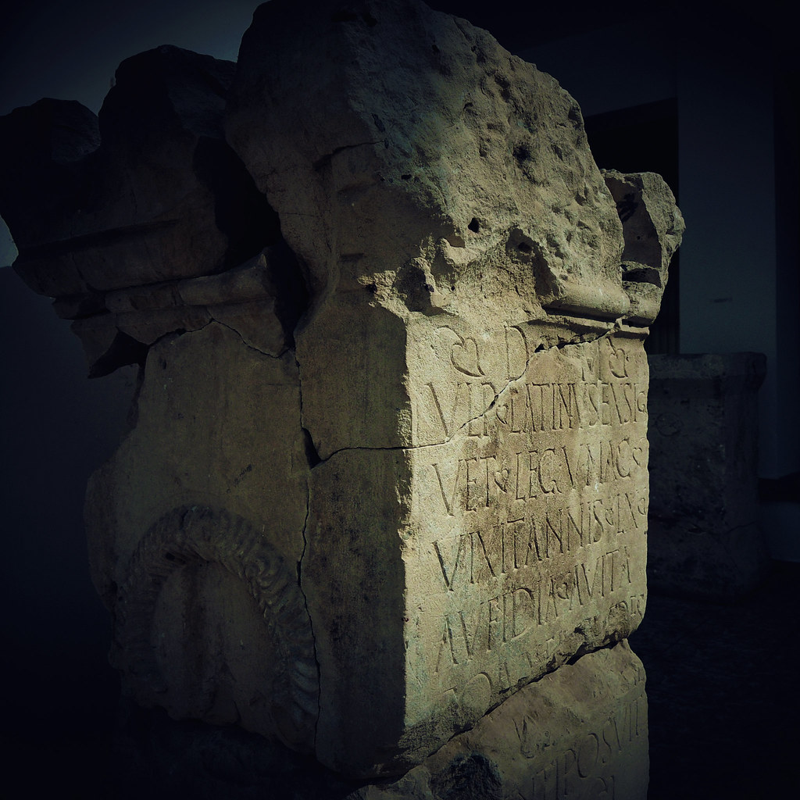

lexicon: four greek words inside your editor

a small dictionary of terms i use daily, with the original sense and what it asks from a design.

---

## automatos

*greek:* acting of itself, self-moving.
*entered english as:* automatic, automation.

the word describes a thing that carries its own motion. a script run by hand is not automation; it is a keyboard shortcut. automation begins when the system decides *when* to act, and therefore must also decide what to do when the world is not what it expects.

**design demand:** if a human has to check it on every run, it is a prompt wearing a cron costume.

---

## kryptos

*greek:* hidden, secret.
*entered english as:* crypt, cryptography.

the interesting part is what it does not mean. cryptography is not "a secret channel". it is a message that can travel in public and stay private, because the secrecy lives in the key, not the pipe.

**design demand:** anything whose security depends on the channel being secret is not secured. hidden is a property of the key. the pipe is assumed hostile.

---

## schema

*greek:* shape, figure, posture.
*entered english as:* schema, schematic.

a database schema is literally a shape. the renaissance borrowed the word for the geometry underneath a painted figure. same idea across three millennia: the shape that everything else hangs from.

**design demand:** schemas are decisions with long lifetimes. code around them changes weekly; the shape outlives several of its authors. treat it like the foundation it is.

---

## systema

*greek:* an organized whole, from *syn* (together) + *histanai* (to stand).
*entered english as:* system.

things that stand together. not a bag of components, not a pile of services. arrangement is the substance of the word.

**design demand:** the removal test. take one part away. if what remains is a pile, there was never a system.

---

## one correction, because it matters

*algorithm* is not greek. it comes from the latinized name of **al-khwārizmī**, the ninth-century mathematician. *robot* is czech, from *robota*, forced labor, via karel čapek's play. *algebra* is arabic.

half the vocabulary of computing is borrowed, which is its own lesson: engineering has always taken its words from whoever solved the problem first. etymology is documentation that survived every rewrite.

## image credits

- cover: [Papyrus in Greek regarding tax issues (3rd ca. BC.)](https://www.flickr.com/photos/64379474@N00/3210586934) by Tilemahos Efthimiadis (by 2.0)
- image: [Histria](https://www.flickr.com/photos/9019841@N08/14623635699) by fusion-of-horizons (by 2.0)
