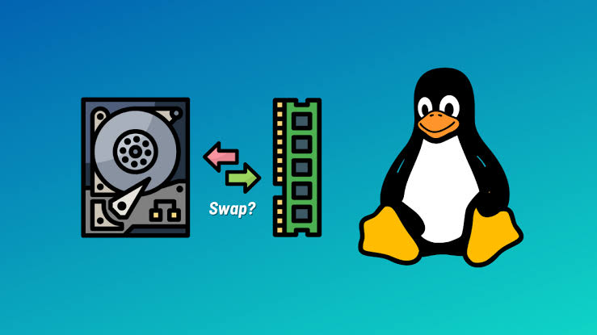

turn off the swap
```sh
sudo swapoff /swap.img
```

set the new swap size
```sh
sudo fallocate -l <SIZE>G /swap.img
```

create the swap on the file
```sh
sudo mkswap /swap.img
```

turn the swap on
```sh
sudo swapon /swap.img
```

---
## What is swap

|  |
| ---------------------- |

On Linux, swap is basically an extension of virtual memory, and it's exactly what it sounds like.

All operating systems need memory to run, so if your RAM runs out, the system might crash or slow down. Swap works like a lifesaver: when the RAM is exhausted, the OS uses swap space as extra memory, even though it's much slower than real RAM.

`"wow, so i can set the swap to 64GB and have lots of RAM?"`

Actually, yes, you can set a large swap, but you shouldn't rely on it as a substitute for physical RAM.

A RAM stick uses a specific type of chip to store data, which is way faster than HDDs and SSDs, because it needs to be fast.

When you use a file or a disk partition as swap, it works, but it's much slower compared to using RAM.

If you try to play a game or render a video while relying on swap, you'll see a drastic drop in FPS.

Swap is really cool, but only when used in the right amount.