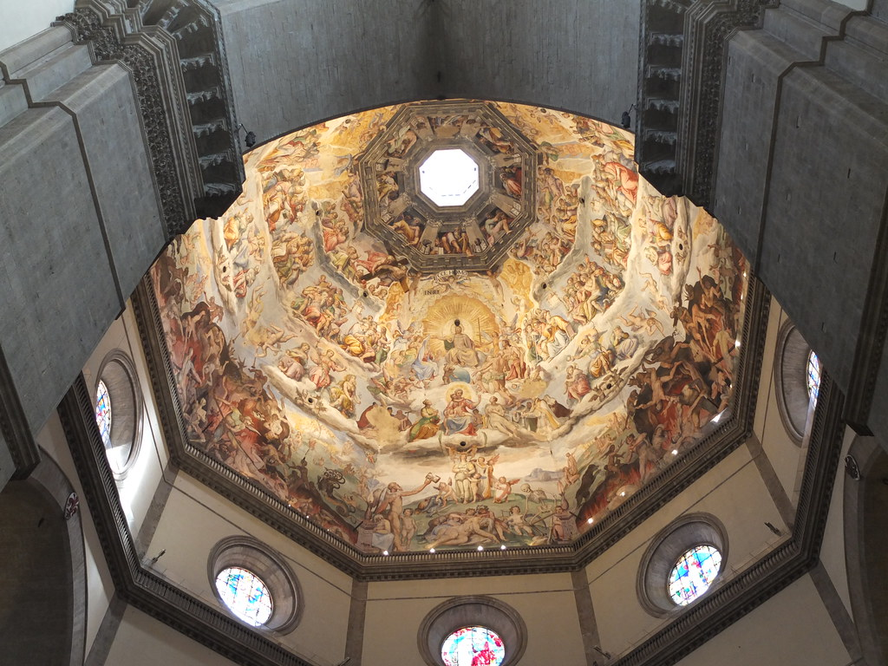

Around 1413, Filippo Brunelleschi set up an experiment in Florence: he painted the Baptistery on a panel, drilled a peephole, and had viewers look through it at a mirror that reflected the painting. If the geometry was right, the painted building lined up with the real one behind the mirror. It was, and a technology was born: **linear perspective**.

What he had built, without knowing the word, was a projection. A 3D scene mapped onto a 2D plane, from a specific point of view.

## the math has not changed

Every time a 3D engine draws a frame, it does what Brunelleschi demonstrated:

- a **camera** with a position and orientation (his peephole),
- a **projection** that maps the scene onto the image plane (his panel),
- a **vanishing point** where parallel lines converge (the horizon line he painted),
- and a **field of view** which is just the angle the panel covers.

The camera matrix in your GPU pipeline is the formalization of a 15th-century painting trick. The difference is speed and automation, not principle.

## perspective is a contract with the viewer

If the geometry is wrong, the illusion collapses. Painters of the time noticed quickly that perspective constrains composition: you can't put a figure wherever you like anymore, or the space betrays you. Artists like Piero della Francesca wrote mathematical treatises because the technique *was* the art.

That is exactly the relationship between a renderer and a scene. The projection defines what's possible. A wrong matrix doesn't produce an "invalid scene", it produces a scene that fails to convince.

## the camera obscura and render settings

Later, the camera obscura let painters project reality directly onto the canvas. They added lenses, filters, shutters. That's a render pipeline: input, optics, exposure, output. Their "settings" were physical; ours are numeric. Same decisions about light and framing.

## what I took from this

- Projection is old. If you understand the vanishing point, you understand the perspective divide.
- Art history is full of engineering solutions that were later formalized. Looking at old tools is a shortcut to understanding modern abstractions.
- Any transformation that maps a space to a surface is a design decision, not neutral math. Perspective chooses who the viewer is.

The first render engine took a mirror, a panel and a very patient audience at 60 frames... per hour. We got faster. The idea stayed.

## image credits

- cover: [Alsace, Haut-Rhin, Colmar, Musée d'UnterLinden : Lucas Cranach l'Ancien ' La Mélancolie ',](https://www.flickr.com/photos/44613506@N07/4841298905) by (vincent desjardins) (by 2.0)
- image: [Florence cathedral dome interior](https://www.flickr.com/photos/18964106@N00/8731865709) by tpholland (by 2.0)
