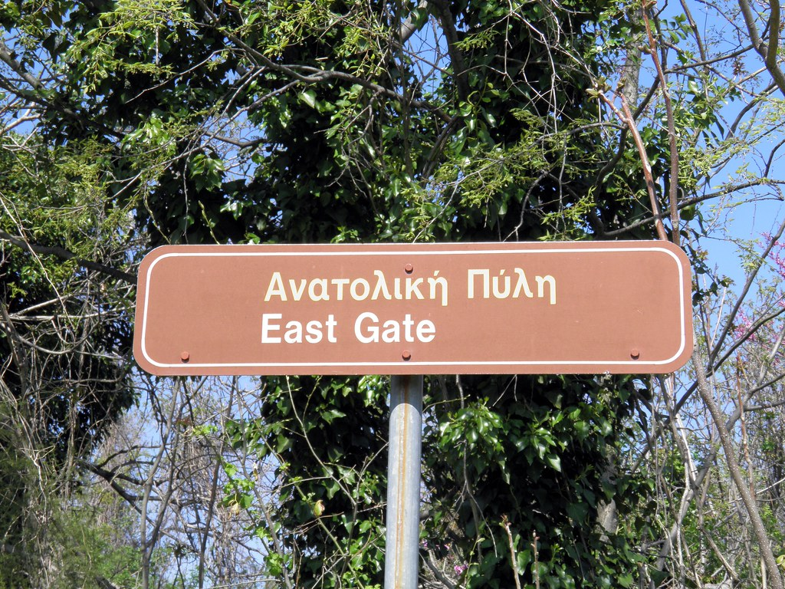

The Romans built about 80,000 km of paved roads, and the system outlived the empire that made it. When I read about how they were built, I can't stop seeing the same decisions we argue about in API design.

## standardization is the product

A Roman road was not just "a road". It followed a specification: prepared ground (*via*), layers of sand and gravel for drainage (*agger*), and slabs fitted so tightly that you could not wedge a blade between them. Widths were standardized enough that a legion could march and carts could pass.

An API is the same promise: not "a way to talk to my service", but a *uniform* way. If every service invents its own conventions, you don't have infrastructure, you have trails. The value is in the conformity, and conformity is boring by design.

## milestones are observability

Roman roads had milestones (*miliaria*) every 1,000 paces, telling travelers the distance to the next town and who built the road. That's a metric with an owner.

It is also exactly what a good status endpoint does: where am I, what is the version, who do I talk to. The traveler on the Via Appia was doing a `GET /health` a couple of thousand years before uptime monitoring.

## layers and maintenance contracts

Under the surface, the road was layered: drainage, foundation, crown. If water doesn't leave, the road dies. In software, the layer you can't see is the one that decides your uptime: connection pooling, migrations, retry policy, backpressure.

And the roads were **maintained**, by law. Curators and contractors were responsible for stretches. When maintenance stopped, the road didn't disappear at once. It decayed silently, until it was a path, then a memory. I think about abandoned repos with no deprecation policy every time I see a Via Appia photo with grass in the joints.

## deprecation existed

The *cursus publicus* had rules about who could use the roads, what could be carried, and which routes were preferred. Emperors changed the rules and posted them. Versioning, with a change log, enforced by legions.

## what I took from this

- Interfaces are a contract, and contracts need a specification people can check against.
- Observability is not new: if travelers need to know where they are, give them milestones.
- Infrastructure decays from the bottom: drainage, maintenance, and migrations, in that order.
- Standardize or don't scale. The empire ran on shared conventions, not on its own genius.

*All roads lead to Rome* is really a statement about compatibility. The road knew nothing about the destination. It just promised to take you there the same way, every time.

## image credits

- cover: [Via Appia ruins](https://www.flickr.com/photos/70591690@N00/688344822) by ZeroOne (by-sa 2.0)
- image: [The East Gate, Ancient Edessa](https://www.flickr.com/photos/41523983@N08/6974660670) by Following Hadrian (by-sa 2.0)
