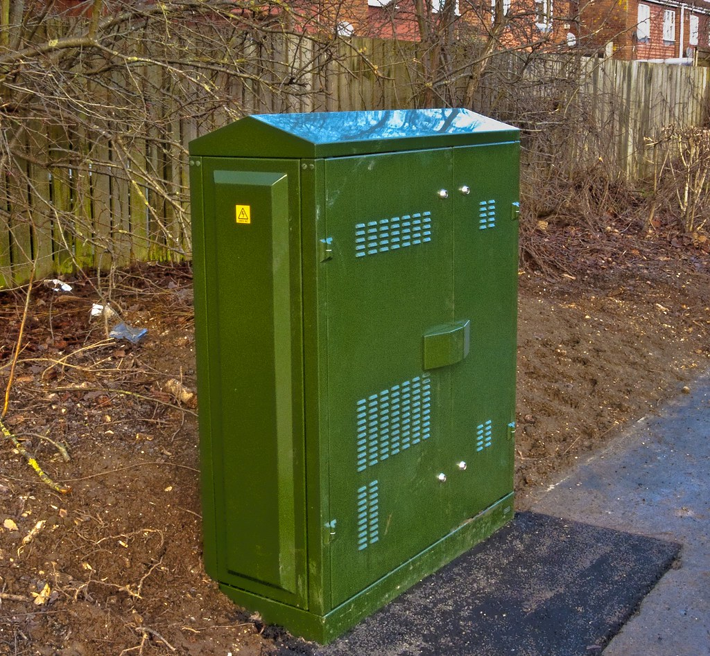

[SmartSec](https://github.com/luis-ota/smartsec-rust) is a security analysis prototype I am building in Rust: a TUI, a headless mode for CI, and a catalog of real scanners. The rule I set before writing the first line: **the scanner binary never runs on the host**.

It sounds paranoid until you list what a scanner is. Nmap and Nuclei are complex C/Go programs that parse untrusted network responses. Running them as my user, on my machine, with my credentials in reach, is a lot of trust for a tool whose whole job is dealing with hostile input.

## containers as the execution boundary

So every scan runs in a rootless Podman container:

- the image is **pinned by digest**, not by tag, so the thing I audited is the thing that runs,
- templates are mounted **read-only**,
- networking is rootless, with no host network access,
- the scanner writes its output to a volume the app reads, and that is the only channel back.

The application orchestrates; the container executes. If a scanner is compromised, it is compromised inside a box that can barely see anything.

## evidence by minimization

The second principle came from reading what scanners emit: huge HTTP bodies, headers, query strings, credentials that happened to appear in a response. I do not want any of that sitting in my reports or logs.

So the pipeline preserves **template, matcher, endpoint, host, URL and tags** and drops everything else. The report stays useful ("this endpoint matched this template") while not becoming a second copy of the data that caused the finding. Minimization is a feature of the evidence model, not a redaction pass bolted on at the end.

## three ways to run, one core

The same engine serves three surfaces:

- an interactive TUI (ratatui + crossterm, mouse support),
- a headless mode (`scan --target`) for pipelines,
- an AI analysis step that runs on a local Ollama by default, with OpenAI/NVIDIA NIM as options.

One core, three adapters. It keeps the TUI from becoming the product and the pipeline path from becoming a second implementation.

## what I took from this

- Isolation is a design decision you make at the boundary, not a flag you add later.
- Pin by digest. Tags are convenient lies.
- Collect the minimum evidence that proves the finding; everything else is liability.
- Keep an "escape hatch" honest: the prototype only ships what really runs, and the README says so.

SmartSec is still a prototype, but the architecture question it forced, *where does untrusted work execute?*, is one I now ask in every project.

## image credits

- cover: [Racks line](https://www.flickr.com/photos/58411470@N00/8475764430) by kewl (by 2.0)
- image: [Fibre to Cabinet, Basingstoke](https://www.flickr.com/photos/27406286@N05/4218894050) by Mike Cattell (by 2.0)
