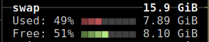
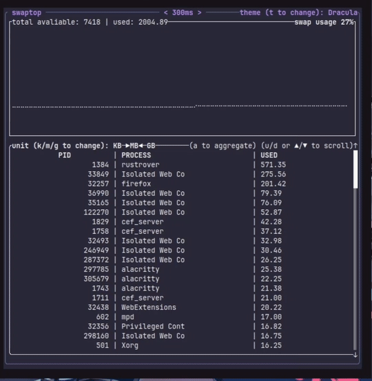
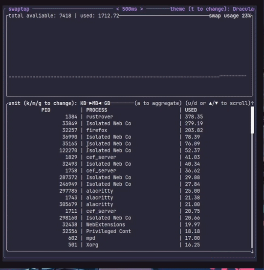

You can find it at: [https://github.com/luis-ota/swaptop/](https://github.com/luis-ota/swaptop/)

## Intro

Recently I started studying [Rust](https://rustup.rs/), Rust is a very cool language to understand complex concepts about computers and SO. It is considered a low-level language but it's actually very easy to learn and apply. I started the [JetBrains Rust course via RustRover](https://plugins.jetbrains.com/plugin/16631-learn-rust/about) and learned a lot about how the language works and its syntax.

## How I study and learn a new tech

After a few modules of the Rust course, I started to forget some of the initial concepts the course aborded. Normally this happens to me, so to reinforce what I learned, I created a simple project.

## The problem to "solve"

Recently I started a new internship. The notebook I use there has only 8GB of RAM. Happily, I could use Linux, so I put 16GB of swap (as recommended `swap = ram * 2`) to avoid RAM problems, but my browser always got slow, probably because it was using only or mostly the swap.  
To confirm I ran:

```bash
printf "%-8s %-20s %s\n" "PID" "NAME" "SWAP(kB)"; for pid in /proc/[0-9]*; do
  statfile="$pid/status"
  [ -r "$statfile" ] || continue
  swap=$(grep VmSwap "$statfile" | awk '{print $2}')
  [ "${swap:-0}" -gt 0 ] || continue
  name=$(grep Name "$statfile" | awk '{print $2}')
  printf "%-8s %-20s %s\n" "$(basename "$pid")" "$name" "$swap"
done | sort -k3 -nr
```

output

```bash
PID      NAME                 SWAP(kB)
12425    pycharm              1191416
14180    spotify              348820
23869    firefox              170060
4407     chrome               169676
32631    chrome               168028
3631     gnome-shell          162048
6007     chrome               157044
14427    chrome               152376
19347    chrome               150880
4633     chrome               137444
14026    spotify              128768
5852     chrome               123128
5736     chrome               116508
24376    Isolated             97088
34630    chrome               85236
6591     chrome               84360
4462     chrome               78020
5546     chrome               74276
13954    chrome               70612
13925    chrome               68340
4884     chrome               67424
14198    chrome               62820
4929     chrome               62228
4634     chrome               61488
...
```

I could confirm: Chrome was using a lot of swap. There's not much I can do about it. The point was:

To find the command to show this output was not very easy, and once I had it I saved it somewhere, and as normally, I lost it.  
So I thought, `is there a tool to monitor swap?`  
I searched for a minute and then realized, `why not make one?`.

## Inspiration

I love TUI tools in the Linux terminal. One of my favorites is [btop](https://github.com/aristocratos/btop). Btop is a very very very pretty TUI tool to monitor hardware usage in Linux. I use it every day. But the info about swap is very simple:  


So my goal was: make a btop-like tool, but for swap  
......... SWAPTOP!

## The Start

First I learned how Linux logs the meminfo: `/proc`

As in the docs: [https://docs.kernel.org/filesystems/proc.html](https://docs.kernel.org/filesystems/proc.html#:~:text=The%20proc%20file%20system%20acts%20as%20an%20interface%20to%20internal%20data%20structures%20in%20the%20kernel.%20It%20can%20be%20used%20to%20obtain%20information%20about%20the%20system%20and%20to%20change%20certain%20kernel%20parameters%20at%20runtime%20\(sysctl\).)

```
The proc file system acts as an interface to internal 
data structures in the kernel. It can be used to obtain
information about the system and to change certain kernel
parameters at runtime (sysctl).
```

So to get the info, I needed to learn the proc filesystem structure and read it, cluster it, etc. Yes, too complicated, or... not.

There's already a Rust lib to consume: [procfs](https://docs.rs/procfs/latest/procfs/).

So the meminfo step was ok.

## The Interface

As I said, I wanted it to be a TUI interface like btop, so I searched for libs in Rust to do it.

First I found [`tui-rs`](https://docs.rs/tui/latest/tui/), then, [`ratatui`](https://github.com/ratatui/ratatui), so I decided to use Ratatui...  
Because, you know, Ratatui!  


So the `frontend` and `backend` tools were there, now time to get hands on.

# The development

- You can find the complete code at: [https://github.com/luis-ota/swaptop/](https://github.com/luis-ota/swaptop/)
## Backend

I created some `struct`s:

For the process lines:

```rust
#[derive(Debug, Clone)]
pub struct ProcessSwapInfo {
    pub pid: i32,
    pub name: String,
    pub swap_size: f64,
}
```

For the chart:

```rust
#[derive(Debug, Clone, Default)]
pub struct SwapUpdate {
    pub aggregated: Vec<ProcessSwapInfo>, 
    pub total_swap: u64,
    pub used_swap: u64,
}
```

And then the functions:

```rust
pub fn get_processes_using_swap(unit: SizeUnits) -> Result<Vec<ProcessSwapInfo>, SwapDataError>{}
```

and

```rust
pub fn get_chart_info() -> Result<SwapUpdate, SwapDataError>{}
```

And some others for features like aggregating and changing the unit from KB, MB, GB, etc.

## Interface

I started by using a Ratatui demo and went from there.

First I created a function to create the lines for the processes list and render it:

```rust
fn create_process_lines(&self, aggregated: bool) -> Vec<Line<'static>> {}

fn render_processes_list(&mut self, frame: &mut Frame, area: Rect, theme: &Theme) {}
```

And a function to render the chart (with a lot of help from DeepSeek...):

```rust
fn render_animated_chart(&mut self, frame: &mut Frame, area: Rect, theme: &Theme) {}
```

After a lot of struggle and trial and error and trying again...

It was there:  


I added some features:

|Key|Action|
|---|---|
|`q`/`Esc`|Quit application|
|`k`/`m`/`g`|Switch units (KB/MB/GB)|
|`a`|Toggle aggregate mode|
|`t`|Cycle through themes|
|`↑`/`u`|Scroll up|
|`↓`/`d`|Scroll down|
|`Ctrl+C`|Force quit|
|`< / >`|Decrease / Increase interval|

Then some themes:  


_voilà_! Swaptop!!!!

## Conclusion

This project was a lot of fun to work and learn with. I learned some new concepts about Linux and Rust language. And I must say it, I fell in love with Rust. What a beautiful and great language it is. I will continue to study and create new projects with it.

Hope you enjoyed reading this post!