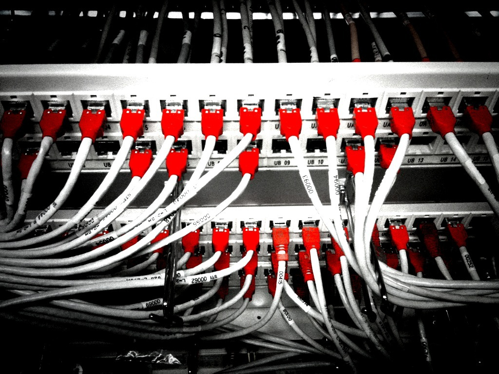

You can find the code at: [github.com/luis-ota/luis-ota-portfolio](https://github.com/luis-ota/luis-ota-portfolio).

This one cost me longer than it should have because the commands *worked*. They just worked on the wrong thing.



I was on a VPS where I had set up rootless Docker as my user (the daemon runs as `ubuntu`, socket under `$XDG_RUNTIME_DIR/docker.sock`). So `docker ps` showed my portfolio, boxdgrid, songhunter containers. Life was good.

Then I inspected the same box with `sudo`:

```bash
$ docker ps                          # my rootless world
CONTAINER ID  IMAGE                    ...  NAMES
...            boxdgrid                 ...  boxdgrid
...            songhunter               ...  songhunter

$ sudo docker ps                     # a completely different world
CONTAINER ID  IMAGE                          ...  NAMES
...            downloadanyvideo-frontend-1  ...  downloadanyvideo-frontend-1
...            downloadanyvideo-backend-1   ...  downloadanyvideo-backend-1
```

Two daemons. Two sets of containers. Two sets of port mappings. And when they try to bind the same host port, the second one loses, because the kernel doesn't care which daemon you like.

## why this happens

Rootless Docker exists so you can run containers without root. The daemon runs as your user, with `rootlesskit` and `slirp4netns` doing the namespace and networking work. The socket lives somewhere like `/run/user/1001/docker/docker.sock`, and the CLI talks to it when the env/context says so.

The rootful daemon lives at `/var/run/docker.sock` and is used by default when you are root or when the CLI falls back to it.

So `docker ps` and `sudo docker ps` are not "the same command with more permissions". They are two different engines, with separate image stores, networks, and containers.

## how I diagnosed it

- `ss -tlnp` showed the listener belonged to `docker-proxy` **running as root**, for a port I thought was managed by my rootless container.
- `docker context ls` and `echo $DOCKER_HOST` tell you where the CLI is pointed.
- `ls -la /var/run/docker.sock $XDG_RUNTIME_DIR/docker.sock` shows which sockets exist.

In my case, the old stack (rootful) was still holding `127.0.0.1:3001` and `:3010`, so the new rootless stack simply could not bind. My deploy script ran as the deploy user (rootless), pulled the same images, and failed with "port already allocated" - which read like a bug in my script, not like a second daemon.

## the fix

Stop the old world. I keep everything on one daemon now (the rootless one), and the deploy scripts always run as the same user with the same context. One daemon, one port table, no ghosts.

If you *do* need both, give each daemon its own host ports, and never debug one while the other owns the socket.

## what I took from this

- `sudo docker` is a different machine. Check `docker context ls` before comparing `ps` output across privileges.
- A port bind failure can mean "the other daemon owns it", not "your config is wrong".
- Rootless Docker is great: no root daemon, better isolation. But it means your automation and your shell must agree on which socket is in play.

## image credits

- cover: [Datacenter Work](https://www.flickr.com/photos/29479498@N05/4381851322) by Leonardo Rizzi (by-sa 2.0)
- image: [network](https://www.flickr.com/photos/30713600@N00/4333178624) by twicepix (by-sa 2.0)
