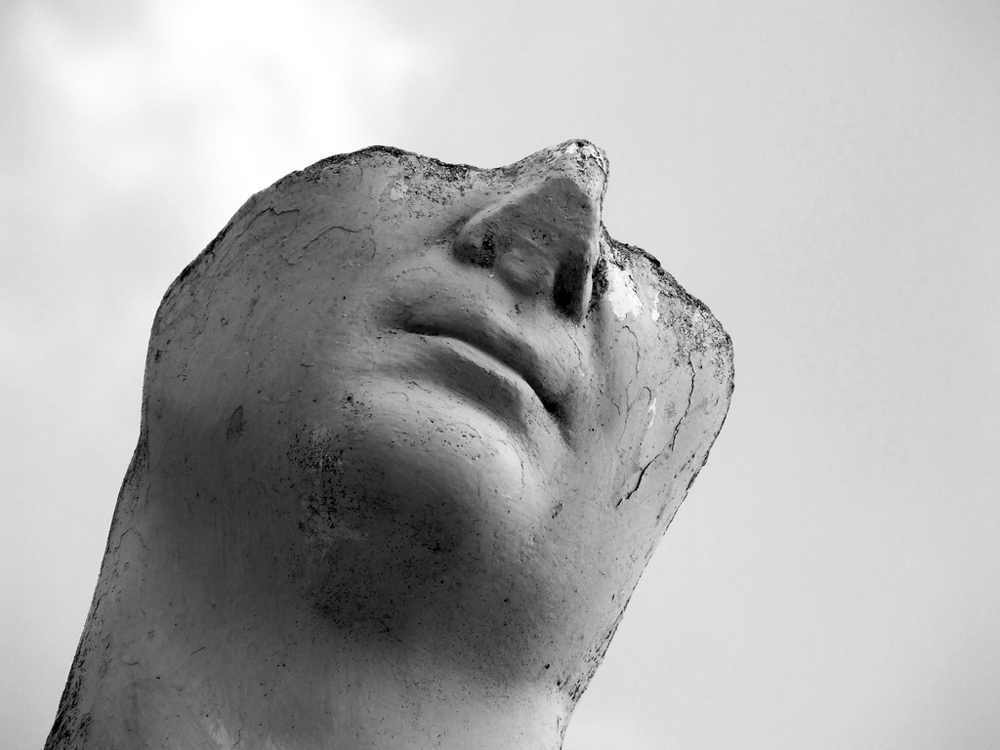

Around 25 BC, a Roman architect named Vitruvius wrote *De Architectura*, and in it he defined what a building must be:

> *firmitas, utilitas, venustas* - durability, utility, beauty.

It survives. We still quote it, mostly about buildings. But I keep coming back to it as a definition of software, because it names the three failure modes I recognize in every codebase.

## firmitas - it has to hold

Durability is not "it never breaks". It's that the thing resists time: foundations, materials, load paths. In software: error handling, tests that exercise failure, migrations that survive real data, a database that doesn't lose a transaction because a process died mid-write.

The Roman trick in concrete was pozzolana, a volcanic ash that made harbor structures hold under water for millennia. The software equivalent is boring infrastructure: idempotency, backups you restore, health checks, no single points of failure. Not clever, just durable.

## utilitas - it has to be used well

Utility is not a feature list. It's the fit between what a person is doing and what the structure allows. A doorway you can carry things through. A dashboard where the number you need is visible at a glance.

This is where I spend more time now than in code style. The question is never "can the user do X", it's "what does the user actually do, in what order, under what pressure". Utility is measured in the world, not in the repository.

## venustas - it has to be worth looking at

Beauty was not decoration to the ancients. Proportion was a claim about correctness - a building that looked wrong usually *was* wrong somewhere in its geometry. The eye catches misalignment before the instrument does.

I think about this every time I align a grid or tune letter-spacing on a page, and every time I name a function badly. A design that feels calm usually means someone made a hundred small decisions consistently. Beauty is the visible residue of rigor.

## what I took from this

- The three qualities are independent. A durable, ugly API is still a failure; a beautiful, fragile app is still a liability.
- Vitruvius also wrote about the architect as a generalist: a bit of law, medicine, astronomy, history. That's the full-stack argument from antiquity.
- When I can't decide whether a change is good, I ask which of the three it serves. If it serves none, it's churn.

Two thousand years later, the checklist still closes the meeting.

## image credits

- cover: [Ancient Columns](https://www.flickr.com/photos/28490141@N03/8550047350) by rabiem22 (by 2.0)
- image: [Roman Statue, marble sculpture. Location](https://www.rawpixel.com/image/6111424/photo-image-face-public-domain-marble) by desconhecido (cc0 1.0)
