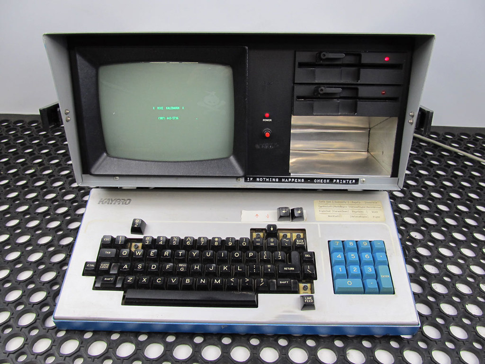

You can find the code at: [github.com/luis-ota/wired-rs](https://github.com/luis-ota/wired-rs).

Listen to `PASTEL GHOST - Abyss` while reading!

<iframe style="border-radius:12px" src="https://open.spotify.com/embed/track/4vgUB5tFrO8K7xasmzleme?utm_source=generator" width="100%" height="152" frameBorder="0" allowfullscreen="" allow="autoplay; clipboard-write; encrypted-media; fullscreen; picture-in-picture" loading="lazy"></iframe>

design notes: wired.rs, a hub with a CRT soul



project: the front door of wired layer co. one page, five tools, no framework.
constraint: it should feel like a machine that is alive but calm.

---

## brief

a list of links would have been honest. it would also have been forgettable. the brief i wrote for myself: a page that argues for craft in ten seconds, loads in one request, and never gets in the way of the actual tool links.

---

## the metaphor

the company is called **wired layer**, so the hub is a layer stack: l0 to l4, each tool a node in the same network. the metaphor decides the information architecture, not the other way around.

- hero: the network itself, drawn on a canvas.
- layers: the tools, one per row, numbered.
- footer: where you are, in plain language.

---

## palette and swap

every color is a css custom property. the page is phosphor green on near-black. the hidden mode (more below) is red. swapping the entire site is one attribute:

```css
html[data-protocolo="7"] {
  --fosforo: #ff5f56;
  --fosforo-fraco: #9b3a34;
}
```

this is the strongest argument i know for tokens over values. theming stopped being a stylesheet problem and became an assignment.

---

## motion budget

three effects, each with a job:

| effect | job | cost control |
|---|---|---|
| canvas network | sets the tone, fills the hero | capped nodes, dpr max 2, paused when tab hidden |
| scanline sweep | makes the screen feel like glass | css gradient, no layout impact |
| wordmark glitch | personality, once every 7s | pseudo-elements, clip-path only |

with `prefers-reduced-motion`, the canvas draws a single static frame and every animation stops. the page stays designed.

---

## the easter egg is the test suite

type `lain` and protocol 7 takes over: red palette, glitch, a dialog. it exists because it is fun. it also forced the page through states that a "simple hub" would never have:

- keyboard detection that ignores modifiers and editable fields,
- a modal with focus management and escape-to-close,
- both languages translated for the dialog,
- reduced motion respected during a full-screen takeover,
- a hud hint (`seq: ____`) that invites discovery without spoiling it.

if a feature survives keyboard-only, both languages, and reduced motion, it is not a toy. it is a stress test that happens to be fun.

---

## deploy

static files, no build. a forced-command ssh key runs `git fetch && git reset --hard` in a clone; nginx serves that directory. the site is the repository, and the deploy takes six seconds.

---

*it is the smallest project i have and the one that most looks like me.*

## image credits

- cover: [Retro computer w/ floppy drive, keyboard](https://sketchfab.com/3d-models/4a3fd162531d4dbe9cf00bcdfde4df01) by David Jalbert (by-sa 4.0)
- image: [『If nothing happens - Check printer 』](https://www.flickr.com/photos/49832497@N02/9754578134) by Kyra Ocean Rehn ♡ (by 2.0)
