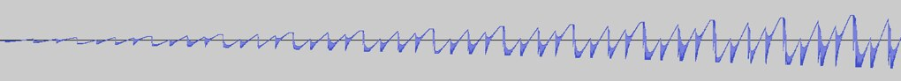

You can find the code at: [luis-ota/songhunter](https://github.com/luis-ota/songhunter), [luis-ota/downloadanyvideo](https://github.com/luis-ota/downloadanyvideo).

the extractor will break. here is the failure matrix.



two tools, one dependency, and a calendar of guaranteed outages.

---

## the dependency

both SongHunter and DownloadAnyVideo call yt-dlp. yt-dlp calls the platforms. the platforms do not have a contract with yt-dlp. when tiktok changes a page or adds a challenge, an extractor breaks, and the version of yt-dlp from three weeks ago is wrong.

this is not a bug I can fix. it is a property of the domain, so the design has to absorb it.

---

## observed failures

| site | error | cause | fix |
|---|---|---|---|
| tiktok | `unexpected response from webpage request` | outdated extractor | update yt-dlp in the image |
| tiktok | same, after update | challenge solver differences | pip package + `curl_cffi` instead of standalone binary |
| instagram | `empty media response` | outdated extractor | same update |
| instagram | login wall on some posts | no cookies | out of scope; public posts work |
| youtube | bot check on some clients | po-token era | deno/js runtime in the image |

the pattern: **the same URL succeeds or fails based on a version number.** nobody changed the video. the world changed.

---

## the matrix I design against

- **version drift** (weeks): fixed by rebuilding on a schedule, not by remembering.
- **challenge changes** (days): fixed by keeping the challenger current, which means newest yt-dlp *and* the optional impersonation dependency.
- **cookie walls** (per post): not fixable without accounts. documented, not hidden.
- **platform outages** (hours): fallbacks.

---

## fallback tree

```
yt-dlp
  ok? -> done
  fail and tiktok? -> tikwm api -> direct media url
  fail and other? -> surface the exact yt-dlp error
```

the fallback is not a second implementation of everything. it is a second *path* for the case with the highest failure rate. one api call, one download, same audio pipeline downstream.

---

## the calendar

both repos rebuild weekly via a scheduled workflow. the image pulls the newest yt-dlp at build time, so the extractors are never more than seven days stale. when the schedule runs and nothing changed, the deploy is a no-op; when it runs and something changed, the fix ships without me reading a changelog.

---

## what "reliable" means here

not "always works". it means:

1. failures are visible and named,
2. the common case self-heals on a schedule,
3. the highest-risk case has a fallback,
4. the unsupported case is documented honestly.

the tools went through the last platform wave without downtime. not because the code got smarter, but because the process stopped depending on me noticing.

## image credits

- cover: [I just finished reading Ready Player One → Geek flashback](https://www.flickr.com/photos/44124348109@N01/13885224116) by jurvetson (by 2.0)
- image: [Unexpectedly Stylish Waveform](https://www.flickr.com/photos/55023503@N00/7745232258) by rndmcnlly (by 2.0)
