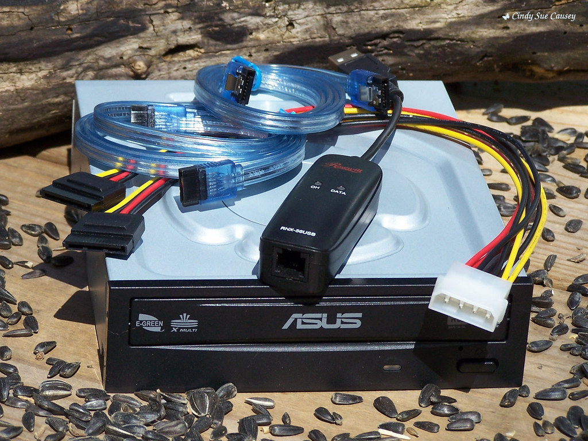

[zcode-opencode-provider](https://github.com/luis-ota/zcode-opencode-provider) is a proof of concept: it exposes a local app-server (ZCode) as an OpenAI-compatible endpoint, so tools like OpenCode can talk to it without knowing anything about the original protocol.

That is a translation problem, and translation problems have a specific kind of bug: everything compiles, the client is happy, and the *semantics* are subtly wrong.

## the contract is not the format

An OpenAI-compatible API is not just "JSON shaped like this". It's a set of behaviors clients depend on:

- message roles and ordering,
- what a "stop" reason means,
- usage accounting,
- streaming vs non-streaming,
- and errors: clients branch on codes and shapes, not on prose.

My MVP does text prompts, one request at a time, non-streaming. That's a deliberate cut: rather than fake streaming with one big chunk, the proxy says what it supports. A compatibility layer that lies about capabilities produces bugs in the *client*, where you can't fix them.

Tool-call translation, session resume and permission dialogs are all listed as not implemented. Explicit non-support is part of the contract too.

## keep the secrets where they live

The proxy never reads or prints the upstream credential. It asks the original app-server to run, and the app-server does its own auth. The proxy sees requests and results, not keys.

It binds to `127.0.0.1` only, and there's no auth because there's no remote access. The README says "do not expose this" in plain words, because a local-only service with no auth becomes a remote open service the moment someone changes a bind address.

## what I took from this

- Compatibility is behavioral. Match what clients *do* with your responses, not just the schema.
- Adapters are where assumptions from two ecosystems meet; document the gaps loudly.
- A local tool should be structurally local: loopback bind, no auth to leak, no secrets to extract.
- MVP is a scope statement, not an apology. Cut features, not honesty.

Every time I integrate two systems now, I start by writing down the mismatches I refuse to hide. That list ends up being the most useful page of the project.

## image credits

- cover: [Leaf Aptus remote battery (self-made)](https://www.flickr.com/photos/10292464@N06/5463758826) by boingr (by-sa 2.0)
- image: [Modem, DVD Burner and SATA cable computer upgrades](https://www.flickr.com/photos/94012640@N00/8596593641) by Cindy Sue Causey (by 2.0)
